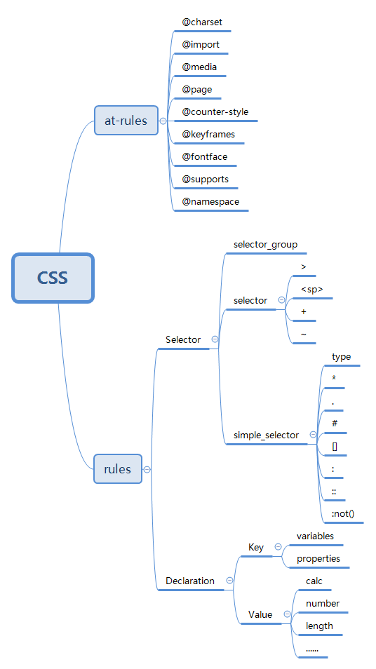
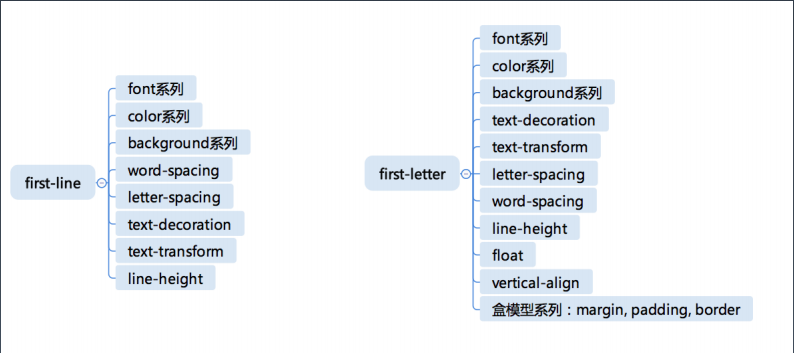

# 重学CSS

## 本周学习章节
* CSS总论|CSS语法的研究
* CSS总论|CSS @规则的研究
* CSS总论|CSS规则的结构
* CSS总论|收集标准
* CSS总论|CSS总论总结
* CSS选择器|选择器语法
* CSS选择器|选择器的优先级
* CSS选择器|伪类
* CSS选择器|伪元素

## 章节内容

#### CSS总论|CSS语法的研究
> 建立一个CSS知识体系骨架，有必要找一个比较权威、比较具有完备性的这样一个线索。从语法入手，构建知识体系

##### CSS2.1的语法
* https://www.w3.org/TR/CSS21/grammar.html#q25.0
* https://www.w3.org/TR/css-syntax-3

##### CSS总体结构
* @charset
* @import
* rules
  * @media
  * @page
  * rule

#### CSS总论|CSS @规则的研究

#### At-rules
* @charset ：https://www.w3.org/TR/css-syntax-3/
* @import ：https://www.w3.org/TR/css-cascade-4/
* @media ：https://www.w3.org/TR/css3-conditional/
* @page ：https://www.w3.org/TR/css-page-3/
* @counter-style ：https://www.w3.org/TR/css-counter-styles-3
* @keyframes ：https://www.w3.org/TR/css-animations-1/
* @fontface ：https://www.w3.org/TR/css-fonts-3/
* @supports ：https://www.w3.org/TR/css3-conditional/
* @namespace ：https://www.w3.org/TR/css-namespaces-3/
  
其中media、keyframes、fontface三个比较常用  

#### CSS总论|CSS规则的结构

##### CSS规则
* 选择器 
* 声明
  * Key
  * Value

```CSS
div {
    background-color: blue;
}
```
标准文档  
* Selector
  * https://www.w3.org/TR/selectors-3/
  * https://www.w3.org/TR/selectors-4/
* Key
  * Properties
  * Variables: https://www.w3.org/TR/css-variables/
* Value
  * https://www.w3.org/TR/css-values-4/

##### CSS知识体系脑图


#### CSS总论|收集标准
js网页爬虫 目标网址：https://www.w3.org/TR/?tag=css
```JavaScript
Array.prototype.slice.call(document.querySelector("#container").children).filter(e => e.getAttribute("data-tag").match(/css/)).map(e => ({name:e.children[1].innerText, url:e.children[1].children[0].href}))
```

#### CSS总论|CSS总论总结
* CSS语法
* at-rule
* selector
* variables
* value
* 实验

#### CSS选择器|选择器语法
##### 选择器语法
* 简单选择器
  * \*
  * div svg|a
  * .cls
  * #id
  * [attr=value]
  * :hover
  * ::before
* 复合选择器
  * <简单选择器><简单选择器><简单选择器>
  * \* 或者 div 必须写在最前面
* 复杂选择器
  * <复合选择器><sp><复合选择器>
  * <复合选择器>">"<复合选择器>
  * <复合选择器>"~"<复合选择器>
  * <复合选择器>"+"<复合选择器>
  * <复合选择器>"||"<复合选择器>

#### CSS选择器|选择器的优先级
##### 简单选择器计数
（[0,0,0,0]，['inline', 'id', 'class', 'tagName']）
```CSS
#id div.a#id {
    //......
}
```
[0, 2, 1, 1]
S = 0 * N³+ 2 * N²+ 1 * N¹+ 1
取N = 1000000
S = 2000001000001

#### CSS选择器|伪类
* 链接/行为
  * :any-link
  * :link :visited
  * :hover
  * :active
  * :focus
  * :target
* 树结构
  * :empty
  * :nth-child()
  * :nth-last-child()
  * :first-child :last-child :only-child
* 逻辑型
  * :not伪类
  * :where :has

#### CSS选择器|伪元素
* ::before
* ::after
* ::first-line
* ::first-letter
  
##### first-line、first-letter可用属性


##### 思考
为什么first-letter可以设置float之类的，而first-line不行呢？