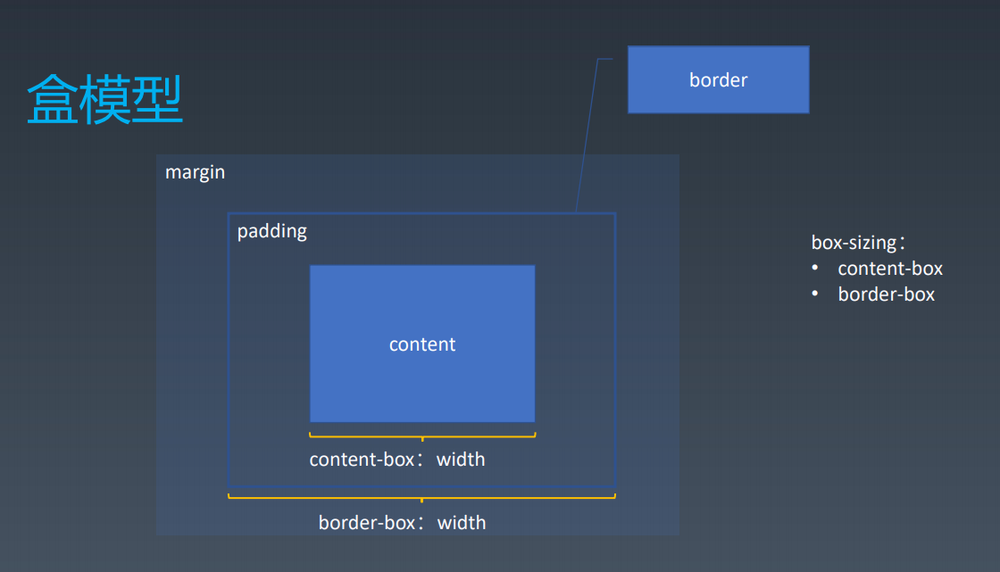
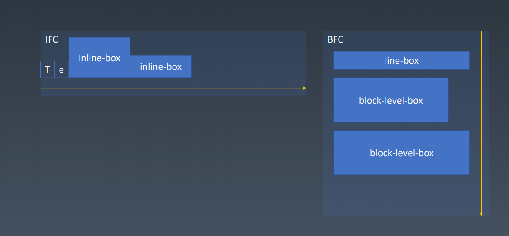
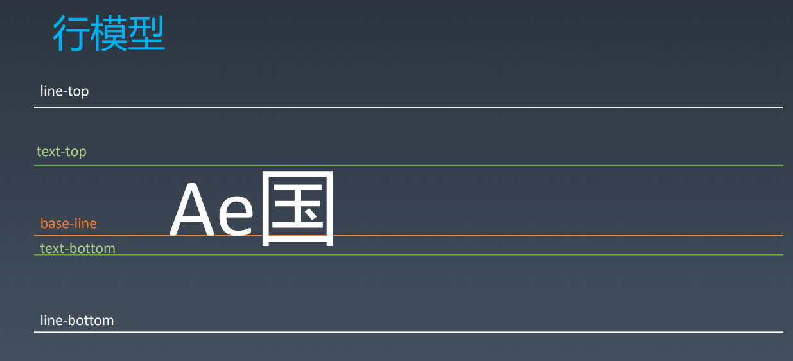

# 重学CSS

## 本周学习章节(CSS的属性)
* CSS排版|盒
* CSS排版|正常流
* CSS排版|正常流的行级排布
* CSS排版|正常流的块级排布
* CSS排版|BFC合并
* CSS排版|Flex排版
* CSS动画与绘制|动画
* CSS动画与绘制|颜色
* CSS动画与绘制|绘制

## 章节内容

#### CSS排版|盒
|  源代码            | 语义     | 表现 |  
|  ----             | ----     | ---- |
| 标签（Tag）        | 元素（Element） | 盒（box）|
> HTML代码中可以书写开始 标签，结束 标签 ，和自封闭 标签 。
> 一对起止 标签 ，表示一个 元素 。
> DOM树中存储的是 元素 和其它类型的 节点（Node）。
> CSS选择器选中的是 元素 。
> CSS选择器选中的 元素 ，在排版时可能产生多个 盒 。
> 排版和渲染的基本单位是 盒 。

##### Box 
> 一个页面是由很多个 Box 组成的，元素的类型和 display 属性决定了这个 Box 的类型。不 同类型的 Box，会参与不同的 Formatting Context。
> Block level的box会参与形成BFC，比如display值为block，list-item，table的元素。
> Inline level的box会参与形成IFC，比如display值为inline，inline-table，inline-block的元素。



#### CSS排版|正常流
##### 三代排版技术 
* 基于正常流和正常流里面的一些基础设施的排版
* 基于flex技术的排版
* 基于grid的排版

##### 正常流排版
* 收集盒进行
* 计算盒在行中的排布
* 计算行的排布

##### IFC 定义
> IFC(Inline Formatting Context)直译为"行内格式化上下文"。inline-box参与

##### IFC 排版规则
> 在行内格式化上下文中，框(boxes)一个接一个地水平排列，起点是包含块的顶部。水平方向上的 margin，border 和 padding在框之间得到保留。框在垂直方向上可以以不同的方式对齐：它们的顶部或底部对齐，或根据其中文字的基线对齐。包含那些框的长方形区域，会形成一行，叫做行框。

##### BFC 定义
> BFC(Block formatting context)直译为"块级格式化上下文"。它是一个独立的渲染区域，只有Block-level-box参与， 它规定了内部的Block-level-Box如何布局，并且与这个区域外部毫不相干。

##### BFC布局规则
> 1. 内部的Box会在垂直方向，一个接一个地放置。
> 2. Box垂直方向的距离由margin决定。属于同一个BFC的两个相邻Box的margin会发生重叠
> 3. 每个元素的左外边缘（margin-left)， 与包含块的左边（contain box left）相接触(对于从左往右的格式化，否则相反)。即使存在浮动也是如此。除非这个元素自己形成了一个新的BFC。
> 4. BFC的区域不会与float box重叠。
> 5. BFC就是页面上的一个隔离的独立容器，容器里面的子元素不会影响到外面的元素。反之也如此。
> 6. 计算BFC的高度时，浮动元素也参与计算

##### 设立BFC
> 1. 根元素或其它包含它的元素
> 2. 浮动 (元素的 float 不是 none)
> 3. 绝对定位的元素 (元素具有 position 为 absolute 或 fixed)
> 4. 非块级元素具有 display: inline-block，table-cell, table-caption, flex, inline-flex
> 5. 块级元素具有overflow ，且值不是 visible




#### CSS排版|正常流的行级排布

##### Baseline
通过基线对齐  

##### 行模型


#### CSS排版|正常流的块级排布

##### float与clear
> float会影响生成行盒的尺寸
> clear寻找一个干净空间执行浮动

##### margin折叠
> 在同一个BFC中的相邻两个元素margin，留白大小为最大的margin


#### CSS排版|BFC合并
##### Block
* Block Container：里面有BFC的
  * 能容纳正常流的盒，里面就有BFC，想想有哪些？
* Block-level Box：外面有BFC的
* Block Box = Block Container + Block-level Box：
里外都有BFC的

##### Block-level Box
Block level
* display:block
* display: flex
* display: table
* display: grid
* ......

Inline level
* display: inline-block
* display: inline-flex
* display: inline-table
* display: inline-grid
* ......
  
display: run-in
 
##### 设立BFC
> 1. floats
> 2. absolutely positioned elements
> 3. block containers (such as inline-blocks, table-cells, and table-captions)
that are not block boxes,
• flex items
• grid cell
• ......
> 4. and block boxes with 'overflow' other than 'visible'


##### BFC合并
* block box && overflow:visible
* BFC合并与float
* BFC合并与边距折叠

#### CSS排版|Flex排版

##### Flex排版
* 收集盒进行
* 计算盒在主轴方向的排布
* 计算盒在交叉轴方向的排布

##### 分行
* 根据主轴尺寸，把元素分进行
* 若设置了no-wrap，则强行分配进第一行

##### 计算主轴方向 
* 找出所有Flex元素 • 把主轴方向的剩余尺寸按比例分配给这些元素
* 若剩余空间为负数，所有flex元素为0，等比压缩剩余元素

##### 计算交叉轴方向 
* 根据每一行中最大元素尺寸计算行高 
* 根据行高flex-align和item-align，确定元素具体位置

#### CSS动画与绘制|动画

##### Animation
* @keyframes定义
* animation: 使用
```CSS
@keyframes mykf
{
    from {background: red;}
    to {background: yellow;}
}
div
{
    animation:mykf 5s infinite;
}
```
> animation-name 时间曲线
> animation-duration 动画的时长；
> animation-timing-function 动画的时间曲线；
> animation-delay 动画开始前的延迟；
> animation-iteration-count 动画的播放次数；
> animation-direction 动画的方向。

##### Transition
* transition-property 要变换的属性；
* transition-duration 变换的时长；
* transition-timing-function 时间曲线；
* transition-delay 延迟。

#### CSS动画与绘制|颜色

##### CMYK与RGB
红黄蓝三原色

##### HSL与HSV
w3c用的HSL 

#### CSS动画与绘制|绘制

##### 绘制
* 几何图形
  * border
  * box-shadow
  * border-radius
* 文字
  * font
  * text-decoration
* 位图
  * background-image

##### 应用技巧
* data uri + svg