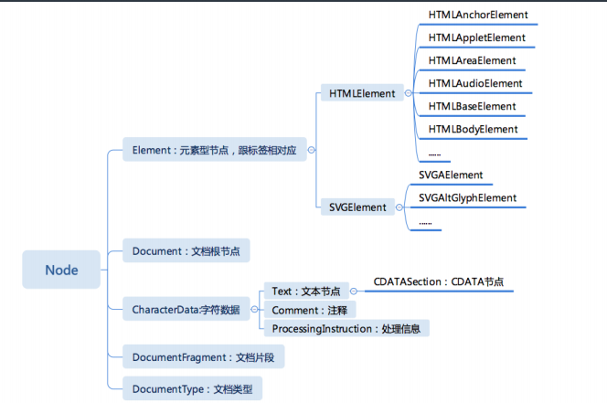

# 重学HTML、浏览器API

## 本周学习章节
* 重学HTML|HTML的定义：XML与SGML
* 重学HTML|HTML标签语义
* 重学HTML|HTML语法
* 浏览器API|DOM API
* 浏览器API|事件API
* 浏览器API|Range API
* 浏览器API|CSSOM
* 浏览器API|CSSOM View
* 浏览器API|其它API

## 章节内容

#### 重学HTML|HTML的定义：XML与SGML

DTD与XML namespace 标准文档
* http://www.w3.org/TR/xhtml1/DTD/xhtml1-strict.dtd
* http://www.w3.org/1999/xhtml

#### 重学HTML|HTML标签语义
语义化标签，通过实践：为wiki编写HTML实现

#### 重学HTML|HTML语法

合法元素
* Element: <tagname>...</tagname>
* Text: text
* Comment: <!-- comments -->
* DocumentType: <!Doctype html>
* ProcessingInstruction: <?a 1?>
* CDATA:<![CDATA[ ]]>

字符引用
* \&#161; &#161;
* \&amp; &amp;
* \&lt; &lt;
* \&quot; &quot;

#### 浏览器API|DOM API
##### 节点脑图

##### 导航类操作  

节点操作
* parentNode
* childNodes
* firstChild
* lastChild
* nextSibling
* previousSibling
  
元素操作  
* parentElement
* children
* firstElementChild
* lastElementChild
* nextElementSibling
* previousElementSibling

##### 修改操作
* appendChild
* insertBefore
* removeChild
* replaceChild

##### 高级操作
* compareDocumentPosition 是一个用于比较两个节点中关系的函数。
* contains 检查一个节点是否包含另一个节点的函数
* isEqualNode 检查两个节点是否完全相同。
* isSameNode 检查两个节点是否是同一个节点，实际上在
JavaScript 中可以用“===”。
* cloneNode 复制一个节点，如果传入参数 true，则会连同子元素
做深拷贝。

#### 浏览器API|事件API

#### 浏览器API|Range API

##### Range API
* range.setStartBefore
* range.setEndBefore
* range.setStartAfter
* range.setEndAfter
* range.selectNode
* range.selectNodeContents

* var fragment = range.extractContents()
* range.insertNode(document.createTextNode("aaaa"))

一个问题
* 把一个元素所有的子元素逆序
* 1    * 5
* 2    * 4
* 3    * 3
* 4    * 2
* 5    * 1

#### 浏览器API|CSSOM

##### document.styleSheets
* document.styleSheets
* 案例

##### Rules
* document.styleSheets[0].cssRules
* document.styleSheets[0].insertRule("p { color:pink; }", 0)
* document.styleSheets[0].removeRule(0)

##### Rule
* CSSStyleRule
  * selectorText String
  * style K-V结构
* CSSCharsetRule
* CSSImportRule
* CSSMediaRule
* CSSFontFaceRule
* CSSPageRule
* CSSNamespaceRule
* CSSKeyframesRule
* CSSKeyframeRule
* CSSSupportsRule
* ......

##### getComputedStyle
* window.getComputedStyle(elt, pseudoElt);
* elt 想要获取的元素
* pseudoElt 可选，伪元素

#### 浏览器API|CSSOM View

##### window
* window.innerHeight, window.innerWidth
* window.outerWidth, window.outerHeight
* window.devicePixelRatio
* window.screen
* window.screen.width
* window.screen.height
* window.screen.availWidth
* window.screen.availHeight

##### Window API
* window.open("about:blank", "_blank", "width=100,height=100,left=100,right=100" )
* moveTo(x, y)
* moveBy(x, y)
* resizeTo(x, y)
* resizeBy(x, y)

##### scroll 
* scrollTop 
* scrollLeft 
* scrollWidth 
* scrollHeight 
* scroll(x, y) 
* scrollBy(x, y) 
* scrollIntoView()
* window 
  * scrollX 
  * scrollY 
  * scroll(x, y) 
  * scrollBy(x, y)

##### layout
* getClientRects()
* getBoundingClientRect()

#### 浏览器API|其它API

##### 标准化组织
* khronos
  * WebGL
* ECMA
  * ECMAScript
* WHATWG
  * HTML
* W3C
  * webaudio
  * CG/WG

##### 作业与实验：全部API的分类和整理

