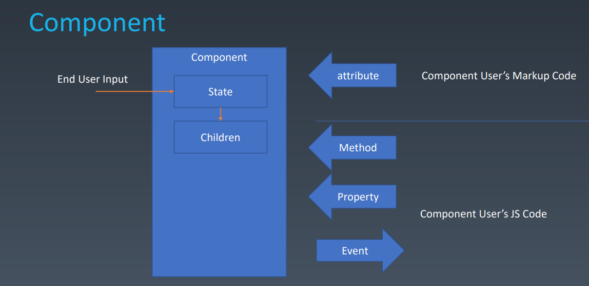

# 组件化

## 本周学习章节
* 组件的基本概念和基本组成部分

## 章节内容

#### 组件的基本概念和基本组成部分

##### 对象与组件

* 对象
  * Properties
  * Methods
  * Inherit
* 组件
  * Properties 
  * Methods 
  * Inherit 
  * Attribute 
  * Config & State
  * Event 
  * Lifecycle 
  * Children



##### Attribute

* Attribute vs Property
  * Attribute 强调描述性
  * Property 强调从属关系

##### Attribute vs Property

```JavaScript
//Attribute:
<my-component attribute="v" />
myComponent.getAttribute("a")
myComponent.setAttribute("a", "value");
//Property:
myComponent.a = "value";
```
```JavaScript
<div class="cls1 cls2"></div>
<script>
var div = document.getElementByTagName('div');
div.className // cls1 cls2
</script>
```
```JavaScript
<div class="cls1 cls2" style="color:blue" ></div>
<script>
var div = document.getElementByTagName('div');
div.style // 对象
</script>
```
```JavaScript
<a href="//m.taobao.com" ></div>
<script>
var a = document.getElementByTagName('a');
a.href // "http://m.taobao.com"，这个 URL 是 resolve 过的结果
a.getAttribute(‘href’) // "//m.taobao.com"，跟 HTML 代码中完全一致
</script>
```
```JavaScript
<input value = "cute" />
<script>
var input = document.getElementByTagName('input'); // 若 property 没有设置，则结果是 attribute
input.value // cute
input.getAttribute('value'); // cute
input.value = 'hello'; // 若 value 属性已经设置，则 attribute 不变，property 化，元素上实际的效果是 property 优先
input.value // hello
input.getAttribute('value'); // cute
</script>
```

##### 如何设计组件状态

|Markup set| JS set| JS Change| User Input Change|
| :---: |:---: |:---: |:---: |
|❌ |✔️| ✔️| ❓| property|
|✔️ |✔️| ✔️| ❓| attribute|
|❌ |❌| ❌| ✔️| state|
|❌ |✔️| ❌| ❌| config|

##### Lifecycle(生命周期)


##### Children

* Content 型 Children 与 Template 型 Children
```Html
<my-button>{{title}}</my-button>
<my-list>
<li>{{title}}</li>
</my-list>
```